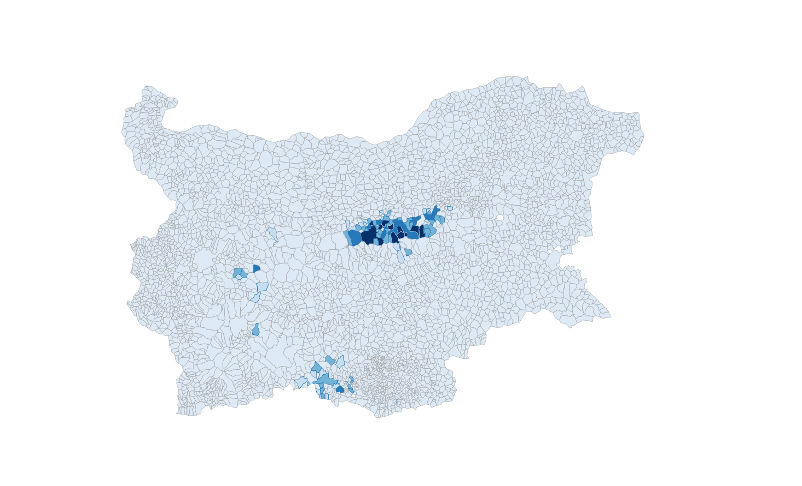

Geocoding Resources for Bulgaria
==================

This is a collection of resources that should help anyone working with geocoding or mapping data in Bulgaria.

Notes on changes made to this repository are available [here](Refactor-methodology.org)

<TODO> Add layers illustration.

## Data Structure
The data in this repository has been organized around the administrative units in Bulgaria. Presented in `.geojson` file format, those are the geospatial entities that can be used for mapping a variety of statistical data. A seperate file has been generated for each administrative level: 

**Geospatial Data**

 | File Name                  | Admin (English)     | Admin (Bg)         | NUTS Level | Feat. Count |
 | -------------------------- | ------------------- | ------------------ | ---------  | ----------- |
 | `country.geojson`          | Country             | Държава            | N/A        |           1 |
 | `regions.geojson`          | Region              | Район              | NUTS 1     |           2 |
 | `planning-regions.geojson` | Planning Region     | Район за планиране | NUTS 2     |           6 |
 | `provinces.geojson`        | Province            | Област             | NUTS 3     |          28 |
 | `municipalities.geojson`   | Municipality        | Община             | LAU        |         265 |
 | `settlements.geojson`      | Settlement Grounds  | Землище            | N/A        |        4611 |
 
 In addition to the admin units there are also some attribute datasets presented in the `data/` directory as `.csv` files. The purpose of those files is to be joined to the spatial layers for mapping purposes.

**Attribute Data**

 | File Name                  | Description                                              | Record Count |
 | -------------------------- | -------------------                                      | -----------  |
 | `ekatte_enhanced.csv`      | EKATTE official info enhanced with additional attributes | 5257         |
 
## Geospatial Data
### `settlements.geojson`
This is a simplified version of the territorial separation of Bulgaria among the grounds of settlements. The shapes do not reflect accurately the actual grounds or their overall size. They do match them within reasonable margin of error, which would be enough for most visualization purposes. More accurate maps can be obtained from the national Cadastre office.

According to the latest data in the [http://www.nsi.bg/nrnm/index.php?i=1&ezik=en](National Registre of Populated Places), there are **5256 populated places in Bulgaria**, 257 cities, 4997 villages, and 2 monasteries. However the `settlements.geojson` file contains only 4611 polygons. The missing 645 settlements are sharing grounds with other settlements, or to be more precise, are located in the grounds of another settlements and their area is listed as 0. There are 230 entities that contain entries under the `CONTAINS_EKATTE_IDS` column where the missing settlements are listed. 

For more information, check http://yurukov.net/blog/2015/03/16/zemlishta/ (in Bulgarian)

| Field               | Data Type | Contains                                                           |
| -----------------   | --------- | ------------------------------------------------------------------ |
| CONTAINS_EKATTE_IDS | String    | List of populated places that belong to the same grounds polygon.  |
| EKATTE_ID           | String    | The ID given to this administrative unit in EKATTE.                |
| LAU_CODE            | String    | The code of the Obstina (Municipality) this settlement belongs to. |
| NAME_BG             | String    | The name of this administrative unit in Bulgarian.                 |
| NAME_EN             | String    | The transliterated name of this administrative unit.               |
| PROVINCE_CODE       | String    | The code of the Oblast (Province) this settlement belongs to.      |
| TYPE_BG             | String    | The type of settlement in Bulgarian (village, city).               |
| TYPE_EN             | String    | The type of settlement in English.                                 |

Examples:
- population distribution in Bulgaria Dec. 2013 https://gist.github.com/yurukov/c4f9ba37b311b53088f1
- logging permits in Bulgaria Apr. 2011 - Dec. 2014 https://gist.github.com/yurukov/136e144bbd634406054e

-----

### `municipalities.geojson`

| Field             | Data Type | Contains                                                           |
| ----------------- | --------- | ------------------------------------------------------------------ |
| EKATTE_ID         | String    | The ID given to this administrative unit in EKATTE.                |
| LAU_CODE          | String    | The code of the Obstina (Municipality) this settlement belongs to. |
| NAME_BG           | String    | The name of this administrative unit in Bulgarian.                 |
| NAME_EN           | String    | The transliterated name of this administrative unit.               |
| NUTS_1_CODE       | String    | The code of the region this unit belongs to.                       |
| NUTS_2_CODE       | String    | The code of the planning-region this unit belongs to.              |
| NUTS_3_CODE       | String    | The code of the Province this unit belongs to according to NUTS.   |
| PROVINCE_CODE     | String    | The code of the Oblast (Province) according to EKATTE              |

-----

### `provinces.geojson`

| Field             | Data Type | Contains                                                           |
| ----------------- | --------- | ------------------------------------------------------------------ |
| EKATTE_ID         | String    | The ID given to this administrative unit in EKATTE.                |
| NAME_BG           | String    | The name of this administrative unit in Bulgarian.                 |
| NAME_EN           | String    | The transliterated name of this administrative unit.               |
| NUTS_1_CODE       | String    | The code of the region this unit belongs to.                       |
| NUTS_2_CODE       | String    | The code of the planning-region this unit belongs to.              |
| NUTS_3_CODE       | String    | The code of the Province this unit belongs to according to NUTS.   |
| PROVINCE_CODE     | String    | The code of the Oblast (Province) this settlement belongs to.      |

-----

### `planning-regions.geojson`

| Field             | Data Type | Contains                                                           |
| ----------------- | --------- | ------------------------------------------------------------------ |
| NAME_BG           | String    | The name of this administrative unit in Bulgarian.                 |
| NAME_EN           | String    | The transliterated name of this administrative unit.               |
| NUTS_1_CODE       | String    | The code of the region this unit belongs to.                       |
| NUTS_2_CODE       | String    | The code of the planning-region this unit belongs to.              |

-----

### `planning-regions.geojson`

| Field             | Data Type | Contains                                                           |
| ----------------- | --------- | ------------------------------------------------------------------ |
| NAME_BG           | String    | The name of this administrative unit in Bulgarian.                 |
| NAME_EN           | String    | The transliterated name of this administrative unit.               |
| NUTS_1_CODE       | String    | The code of the region this unit belongs to.                       |
| NUTS_2_CODE       | String    | The code of the planning-region this unit belongs to.              |

-----

### `regions.geojson`

| Field             | Data Type | Contains                                                           |
| ----------------- | --------- | ------------------------------------------------------------------ |
| NAME_BG           | String    | The name of this administrative unit in Bulgarian.                 |
| NAME_EN           | String    | The transliterated name of this administrative unit.               |
| NUTS_1_CODE       | String    | The code of the region this unit belongs to.                       |

-----

### `country.geojson`

| Field             | Data Type | Contains                                                           |
| ----------------- | --------- | ------------------------------------------------------------------ |
| NAME_BG           | String    | The name of this administrative unit in Bulgarian.                 |
| NAME_EN           | String    | The transliterated name of this administrative unit.               |
| COUNTRY_CODE      | String    | The code of the country.                                           |

-----

## Attribute Data
### EKATTE -- Unified Classification of Administrative-Territorial and Territorial UnitsNational Settlements Registre

### NSI -- National Statistical Institute
### Eurostat
## Sources
