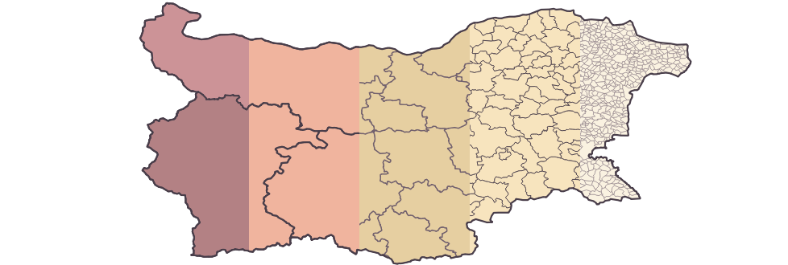

###### *Notes on changes made to this repository are available [here](Refactor-methodology.org)*

Geocoding Resources for Bulgaria
==================

This is a collection of resources that should help anyone working with geocoding or mapping data in Bulgaria.

## Overview

The data in this repository has been organized around the administrative units in Bulgaria presented in `.geojson` file format. Since most statistical data is gathered and aggregated using those same entities, the organization of the files and data tables is convenient for mapping a variety of official sources of information. To make mapping as easy as possible seperate `.geojson` files have been extracted for the different admin levels. Each of them have the ids of the applicable statistical units (EKATTE in Bulgaria and NUTS on European level) associated with the polygon features. 

**Geospatial Layers Overview**

 | File                                                  | Administrative Unit                   | NUTS Level | Feature Count |
 | ---------------------------------------------         | ------------------------------------- | ---------  |   ----------- |
 | [`country.geojson`](#countrygeojson)                  | Country (Държава)                     | N/A        |             1 |
 | [`regions.geojson`](#regionsgeojson)                  | Region (Район)                        | NUTS 1     |             2 |
 | [`planning-regions.geojson`](#planningregionsgeojson) | Planning Region (Район за планиране)  | NUTS 2     |             6 |
 | [`provinces.geojson`](#provincesgeojson)              | Province (Област)                     | NUTS 3     |            28 |
 | [`municipalities.geojson`](#municipalitiesgeojson)    | Municipality (Община)                 | LAU        |           265 |
 | [`settlements.geojson`](#settlementsgeojson)          | Settlement Grounds (Землище)          | N/A        |          4611 |
 |                                                       |                                       |            |               |
 
Besides the geospatial information outlined above, we also make an effort to provide some official datasets with attribute information that can be immediately joined to the polygons of the administrative units for mapping and analysis. Those datasets are located in the `data/` directory and are presented as `.csv` files along with a respectful `.csvt` files that contain metainformation about their column data types.

**Attribute Data**

 | File Name                     | Description                                              | Record Count |
 | ----------------------------- | -------------------------------------------------------- | ------------ |
 | `ekatte_enhanced_06-2018.csv` | EKATTE official info enhanced with additional attributes |         5256 |
 | `census_data_settlements.csv` | Historical census data on settlement level               |         5356 |
 
**Notes on the number of settlements/grounds discrepancy**:

According to the latest data in the [National Registre of Populated Places](http://www.nsi.bg/nrnm/index.php?i=1&ezik=en), there are **5256 populated places in Bulgaria**, 257 cities, 4997 villages, and 2 monasteries. However the `settlements.geojson` file contains only 4616 polygons. The missing 640 settlements are sharing grounds with other settlements, or to be more precise, are located in the grounds of another settlements and their area is listed as 0. The one-to-many relationship between the parent settlement (which has a grounds polygon) and the children settlements belonging to it can be established using the `rel_settl_ground.csv` file, which contains the 226 distinct parent settlement grounds along with the IDs of their children. Those are illustrated on the map below:

For more information, check http://yurukov.net/blog/2015/03/16/zemlishta/ (in Bulgarian)

## Geospatial Data
### `settlements.geojson`
This is a simplified version of the territorial separation of Bulgaria among the grounds of settlements. The shapes do not reflect accurately the actual grounds or their overall size. They do match them within reasonable margin of error, which would be enough for most visualization purposes. More accurate maps can be obtained from the national Cadastre office.

| Field               | Data Type | Contains                                                           |
| -----------------   | --------- | ------------------------------------------------------------------ |
| EKATTE_ID           | String    | The ID given to this administrative unit in EKATTE                 |
| LAU_CODE            | String    | The code of the Obstina (Municipality) this settlement belongs to. |
| NAME_BG             | String    | Name in Bulgarian                                                  |
| NAME_EN             | String    | Name in English (Transliterated)                                   |
| PROVINCE_CODE       | String    | The code of the Oblast (Province) this settlement belongs to       |
| TYPE_BG             | String    | The type of settlement in Bulgarian (с., гр.)                      |
| TYPE_EN             | String    | The type of settlement in English (vill., city)                    |

Examples:
- population distribution in Bulgaria Dec. 2013 https://gist.github.com/yurukov/c4f9ba37b311b53088f1
- logging permits in Bulgaria Apr. 2011 - Dec. 2014 https://gist.github.com/yurukov/136e144bbd634406054e

-----

### `municipalities.geojson`

| Field             | Data Type | Contains                                                                                     |
| ----------------- | --------- | ------------------------------------------------------------------                           |
| EKATTE_ID         | String    | The ID given to this administrative unit in EKATTE                                           |
| LAU_CODE          | String    | The code of the municipality also known as LAU (Local Administrative Unit) according to NUTS |
| NAME_BG           | String    | Name in Bulgarian                                                                            |
| NAME_EN           | String    | Name in English (Transliterated)                                                             |
| NUTS_1_CODE       | String    | The code of the region this unit belongs to.                                                 |
| NUTS_2_CODE       | String    | The code of the planning-region this unit belongs to.                                        |
| NUTS_3_CODE       | String    | The code of the Province this unit belongs to according to NUTS.                             |
| PROVINCE_CODE     | String    | The code of the Oblast (Province) according to EKATTE                                        |

-----

### `provinces.geojson`

| Field             | Data Type | Contains                                                           |
| ----------------- | --------- | ------------------------------------------------------------------ |
| EKATTE_ID         | String    | The ID given to this administrative unit in EKATTE.                |
| NAME_BG           | String    | Name in Bulgarian                                                  |
| NAME_EN           | String    | Name in English (Transliterated)                                   |
| NUTS_1_CODE       | String    | The code of the region this unit belongs to.                       |
| NUTS_2_CODE       | String    | The code of the planning-region this unit belongs to.              |
| NUTS_3_CODE       | String    | The code of the Province this unit belongs to according to NUTS.   |
| PROVINCE_CODE     | String    | The code of the Oblast (Province) this settlement belongs to.      |

-----

### `planning-regions.geojson`

| Field             | Data Type | Contains                                                           |
| ----------------- | --------- | ------------------------------------------------------------------ |
| NAME_BG           | String    | Name in Bulgarian                                                  |
| NAME_EN           | String    | Name in English (Transliterated)                                   |
| NUTS_1_CODE       | String    | The code of the region this unit belongs to.                       |
| NUTS_2_CODE       | String    | The code of the planning-region this unit belongs to.              |

-----

### `planning-regions.geojson`

| Field             | Data Type | Contains                                                           |
| ----------------- | --------- | ------------------------------------------------------------------ |
| NAME_BG           | String    | Name in Bulgarian                                                  |
| NAME_EN           | String    | Name in English (Transliterated)                                   |
| NUTS_1_CODE       | String    | The code of the region this unit belongs to.                       |
| NUTS_2_CODE       | String    | The code of the planning-region this unit belongs to.              |

-----

### `regions.geojson`

| Field             | Data Type | Contains                                                           |
| ----------------- | --------- | ------------------------------------------------------------------ |
| NAME_BG           | String    | Name in Bulgarian                                                  |
| NAME_EN           | String    | Name in English (Transliterated)                                   |
| NUTS_1_CODE       | String    | The code of the region this unit belongs to.                       |

-----

### `country.geojson`

| Field             | Data Type | Contains                                                           |
| ----------------- | --------- | ------------------------------------------------------------------ |
| NAME_BG           | String    | Name in Bulgarian                                                  |
| NAME_EN           | String    | Name in English (Transliterated)                                   |
| COUNTRY_CODE      | String    | The code of the country.                                           |

-----

## Attribute Data
### data/ekatte_enhanced_06-2018.csv

This file contains the information from EKATTE (Unified Classification of Administrative-Territorial and Territorial Units) enhanced with some additional columns of important information. The first couple of those are the `contains_ekatte_ids` column which lists the ids of settlements that do not have their own grounds, and `contained_in` which lists the id of the settlement this unit is contained in. Also a column `area` is included, which lists the area of the grounds taken from the National Statistical Institute's web site.

### data/census_data_settlements.csv

This file includes historical population data on settlement level.
